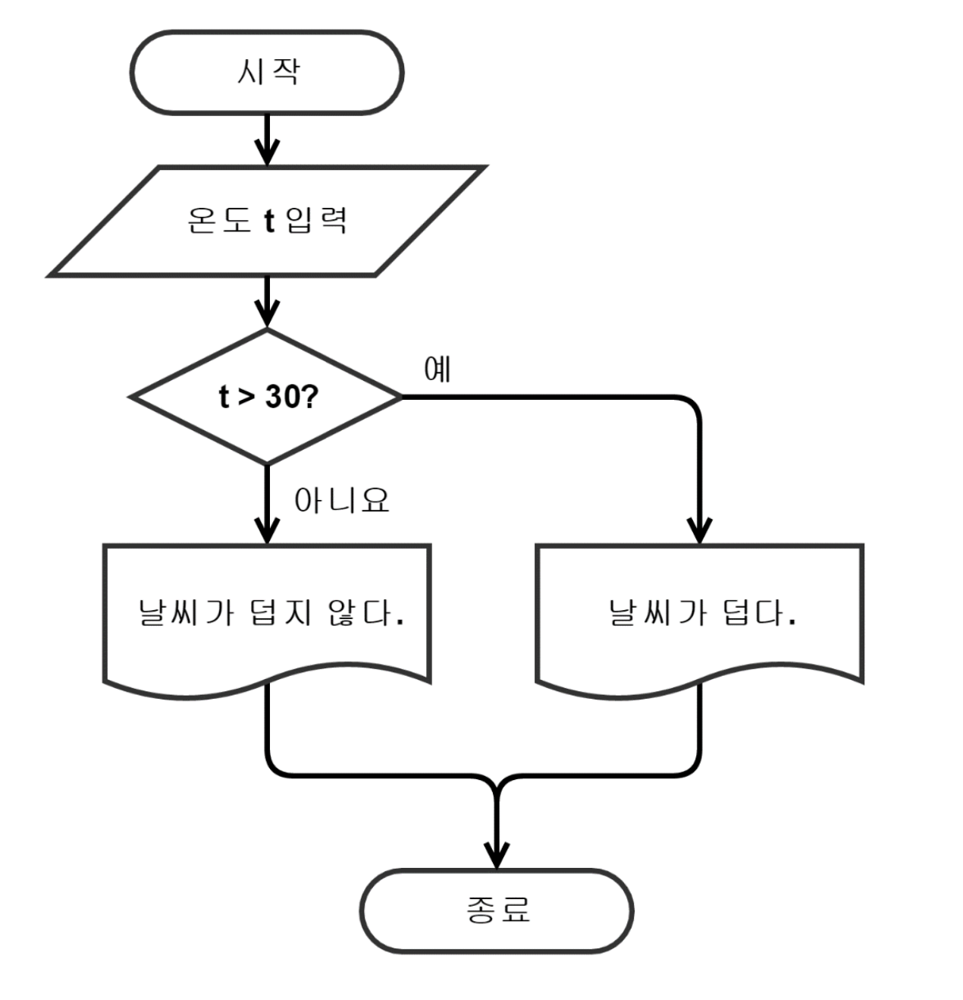

# miniProjects

## 3. DOM 객체 다루기\_ 끝말잇기 게임

### 3.1 순서도 그리기

순서도(Flowchart)

- 처리하고자 하는 문제를 분석하여 국제표준기구(ISO : International Standardization Organization)에서 지정한 기호와 흐름선을 활용,
  프로세스의 처리 순서를 포함한 단계 간의 상호관계를 알기 쉽게 나타낸 그림이다. 원고의 초안, 건축의 설계도와 같은 프로그래밍의
  기초가 되며 타인에게 전달, 크로스랭귀징, 유지보수 등에 기반이 되는 중요한 요소이다.

일반적인 작성 규칙: - 약속된 표준 기호를 사용한다.

- 흐름에 따라 위에서 아래로, 왼쪽에서 오른쪽으로 그리며 서로 교차하지 않도록 한다.
- 처리내용은 기호 내부에 간단명료하게 기술하고, 필요하면 외부의 주석기호에 추가기록하도록 한다.
- 한 면에 다 그릴 수 없거나 연속적인 표현이 어려울 때는 연결기호(연결자)를 사용한다.
- 문제가 복잡하고 어려울 때에는 처리 블록별로 나누어 단계적으로 그려나간다.

순서도 작성

- 시작과 끝: 타원
- 일반적인 처리: 사각형
- 조건(분기점): 마름모
- 화면 출력: 잘린 종이
- 데이터 입력: 평행사변형


{: width="50%" height="50%"}

순서도 작성시 주의점

- 기호 내에는 최대한 간략하게 내용을 기입하여 가독성을 향상시킨다.
- 비교/판단 기호 사용시 입/출력은 반드시 하나여야하며, 결과는 Yes or No여야 한다.
- 동일한 처리의 중복을 피한다.



### 3.2 HTML 화면 만들기

- html 코드 작성

### 3.3 값 입력받아 변수에 저장하기

### 3.4 HTML태그 선택하기

### 3.6 찻 딘어를 입력한 사람인지 판단하기

### 3.7 올바른 단어인지 판단하기

### 3.8 틀렸을 때 오류 표시하기

### 3.9 순서도 최적화하기

---

3.  2<sup>e</sup>

sadfslkdjflksjdf  
sadfjslkdfjklsf<br>
sdfasdflksjf

asdfsdf

```js
var asfd = "sadfasdf";
console.log(asfd === "sdafasdfs");
```
